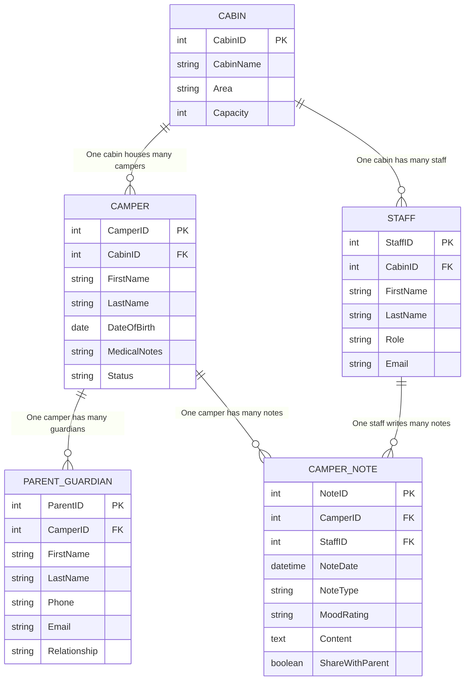

# Camp Saranac Young Life — Database ERD

> 5 core entities. Centralizes camper data, staff notes, and parent communication.

---

---

## Relationships

| From | Type | To | Description |
|---|---|---|---|
| CABIN | **One-to-Many** | CAMPER | One cabin houses many campers |
| CABIN | **One-to-Many** | STAFF | One cabin is assigned many staff |
| CAMPER | **One-to-Many** | PARENT_GUARDIAN | One camper can have multiple guardians |
| CAMPER | **One-to-Many** | CAMPER_NOTE | One camper accumulates many notes over time |
| STAFF | **One-to-Many** | CAMPER_NOTE | One staff member can write many notes |
