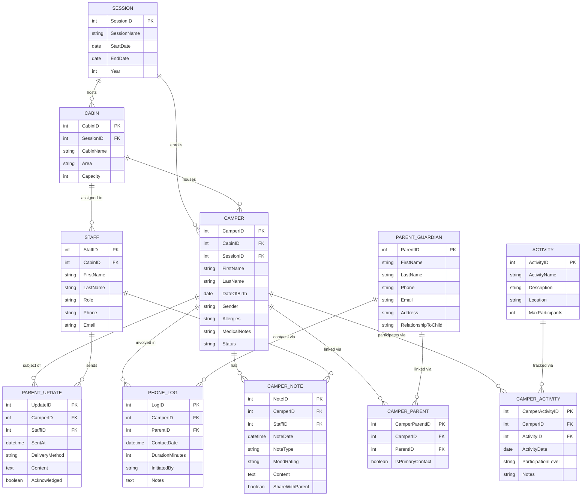

# Camp Saranac Young Life — Database ERD

> Entity-Relationship Diagram for the Saranac Young Life Sleepaway Camp management system.  
> Purpose: centralize camper data, staff notes, parent communication, and activity tracking.

---

---

## Entities

| Entity | Description |
|---|---|
| **SESSION** | A camp session (week or period). Anchors all cabins and campers to a time window. |
| **CABIN** | Physical sleeping unit. Belongs to a session, houses campers, assigned to staff. |
| **CAMPER** | The child. Linked to a cabin and session. Holds medical/allergy info. |
| **PARENT_GUARDIAN** | Parent or guardian. Linked to campers via junction (supports siblings + two parents). |
| **CAMPER_PARENT** | Junction resolving the M:M between campers and parents. Flags primary contact. |
| **STAFF** | Counselors, admins, nurses. Assigned to a cabin. Write notes and send parent updates. |
| **CAMPER_NOTE** | Staff observations — behavior, mood, adjustment, wellbeing. Core of the system. `ShareWithParent` controls visibility. |
| **ACTIVITY** | Camp activity catalog (archery, swimming, hiking, etc.). |
| **CAMPER_ACTIVITY** | Junction tracking which campers attended which activities, with participation level. |
| **PARENT_UPDATE** | Deliberate outbound communication to parents — separate from internal notes. |
| **PHONE_LOG** | Tracks the limited phone contact events between campers/parents and camp. |

---

## Key Design Decisions

- **CAMPER_PARENT junction** — A camper can have two parents; siblings share a parent. A direct FK on either side would break down.
- **CAMPER_NOTE vs PARENT_UPDATE** — Notes are internal staff records. Updates are deliberate parent-facing communications. Keeping them separate lets staff write candidly without every note going to families.
- **ShareWithParent flag on CAMPER_NOTE** — Staff can mark specific notes to surface in parent-facing views.
- **MoodRating on CAMPER_NOTE** — Tracks homesickness and adjustment over time (happy / neutral / homesick / struggling).
- **PHONE_LOG** — Directly addresses the limited phone access problem Mia identified. Tracks when contact happened, who initiated, and what was discussed.
- **SessionID on both CAMPER and CABIN** — Supports multi-year data. Same camper returns next summer as a clean new enrollment without losing history.
